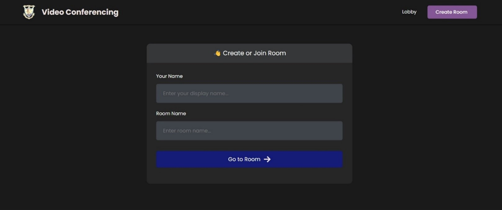
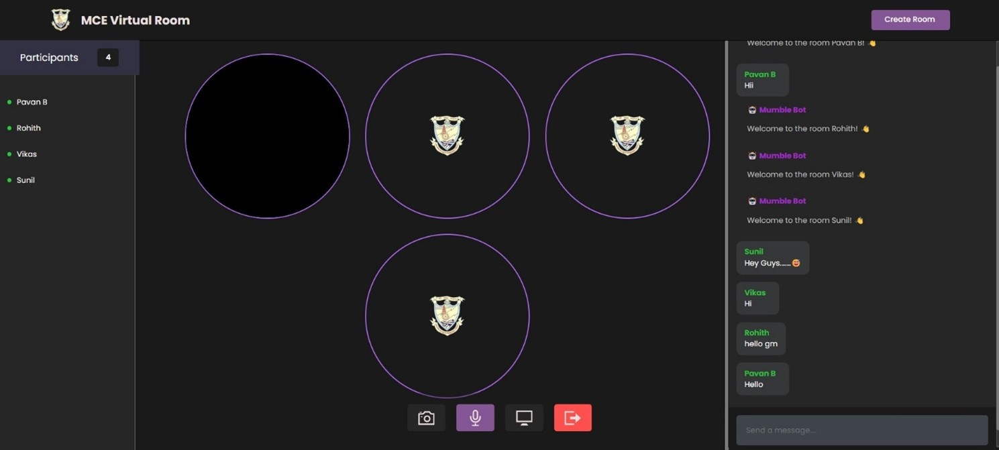
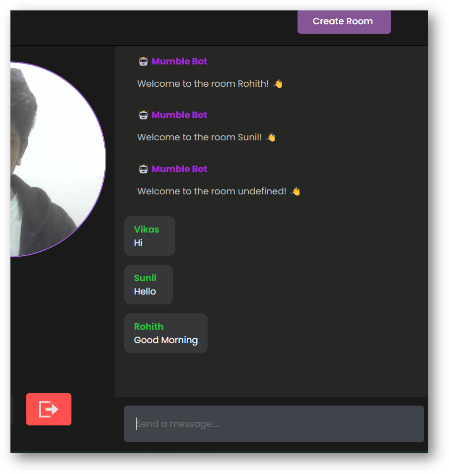
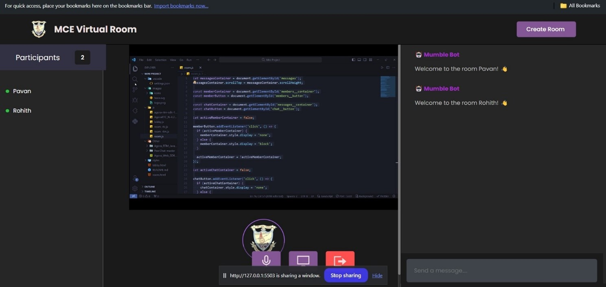
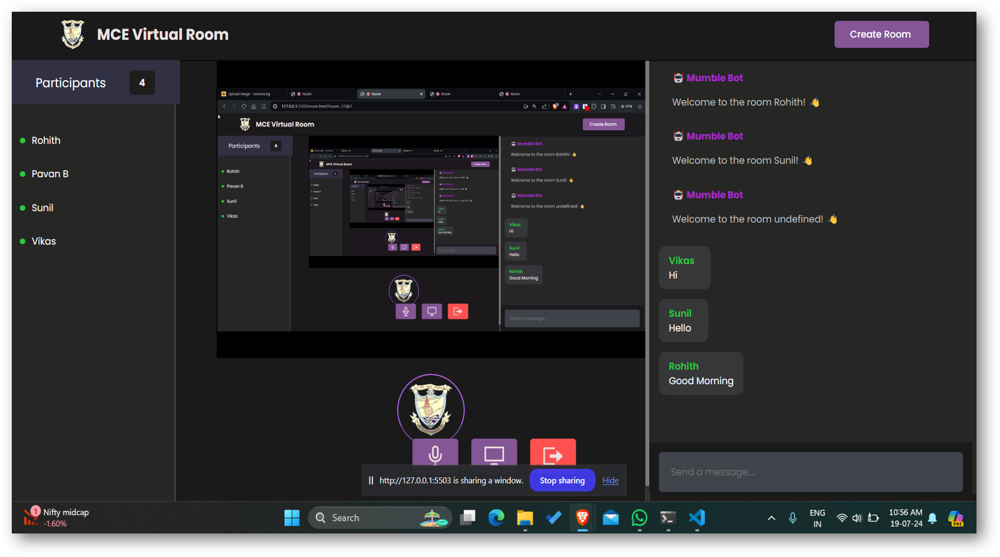
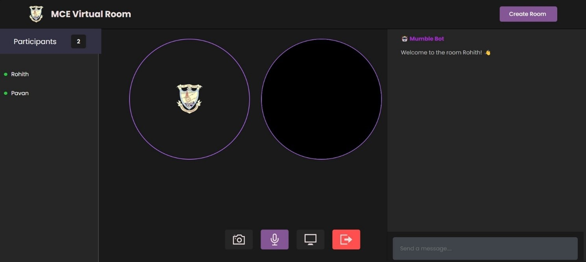

<h1>Real-Time Video Conferencing Application</h1>
<h3>Overview</h3>
This project implements a real-time video conferencing application using WebRTC, designed to facilitate seamless audio and video communication directly between web browsers. It includes features such as text chat, screen sharing, and file transfer, aiming to offer a customizable, secure, and user-friendly solution for remote communication.

<h3>Features</h3>
<ol>
<li>Real-Time Audio & Video Streaming: High-quality, low-latency communication.</li>
<li>Text Chat Integration: Send and receive messages during calls.</li>
<li>Screen Sharing: Share your screen with participants.</li>
<li>Secure Communication: End-to-end encryption and peer-to-peer connections.</li>
</ol>

<h3>Tech Stack</h3>
<ol>
<li>Frontend: HTML, CSS, JavaScript</li>
<li>Real-Time Communication: WebRTC</li>
<li>Third-Party Service: Agora</li>
</ol>

<!-- Login Image -->

<!-- RTM Image (JPEG) -->

<!-- RTM Image (PNG) -->

<!-- ScreenShare Image (JPEG) -->

<!-- ScreenShare Image (PNG) -->

<!-- View Image -->

